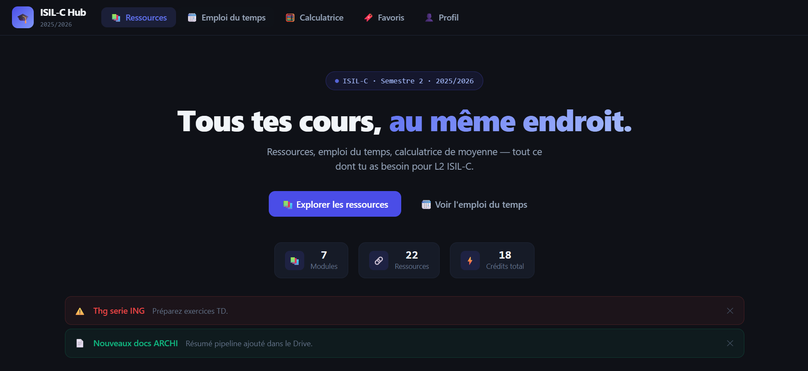
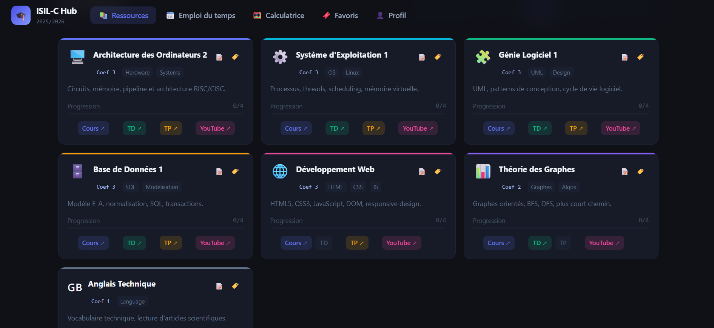

# ISILC Student Hub

A web application built to help ISILC students access resources, manage their timetable, and use useful tools in one place.

## 🚀 Features

* 📚 Resources page
* 🗓️ Timetable
* 🧮 Calculator
* 🔖 Bookmarks system
* 📢 Announcements integration (coming soon)

## 🛠️ Tech Stack

* React
* Tailwind CSS
* Zustand (state management)

## 📦 Installation

```bash
npm install
npm run dev
```

## 🌐 Live Demo

👉 isilc-hub.netlify.app

## 📸 Screenshots




## 📌 Author

Zighed Imen

## 💡 Notes

This project was built as part of my learning journey in React.

